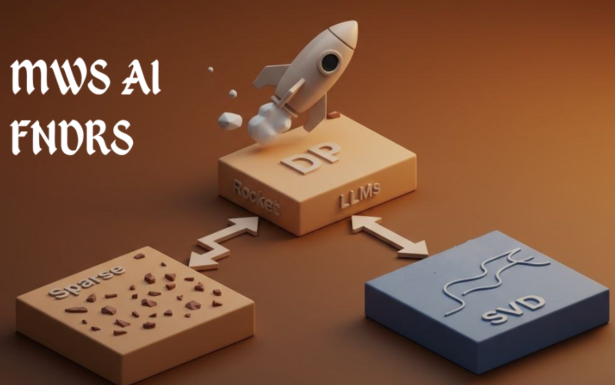

# 🚀 ROCKET: Rapid Optimization via Calibration-guided Knapsack Enhanced Truncation for Efficient Model Compression
[](https://arxiv.org/abs/2602.11008)
[](https://opensource.org/licenses/Apache-2.0)
[](https://www.python.org/downloads/)
[]()
[]()

In a quiet corner of the AI research lab, a cartoon rocket stood on the launchpad—bright red, cheerful, and boldly labeled “LLM.” At the control console sat a scientist, fingers hovering over a single, enormous red button marked “Solve MCKP.”
With a deep breath and a flicker of hope, they pressed it.
The rocket roared to life. Flames erupted, scattering clouds of sparse matrices like confetti made of zeros. As the LLM blasted into the stratosphere of efficient inference, it left behind on the pad a humble knapsack overflowing not with gold, but with perfectly balanced (rank, sparsity) pairs: the optimal solutions to the Multiple-Choice Knapsack Problem, handpicked for model compression.
Up it soared lighter, faster, smarter carrying only what truly mattered.
```
rocket/
├── setup.py
├── rocket/
│   ├── __init__.py
│   ├── config/
│   │   └── default.yaml
│   ├── data/
│   │   ├── __init__.py
│   │   └── prepare_data.py          # prepare_data logic (calibration data activations)
│   ├── calib/
│   │   ├── __init__.py
│   │   └── calib.py                 # Calib class (Calib.build_calibration_dataset, Calib.get_s_inv_s, etc.) (Whitening transform)
│   ├── profiling/
│   │   ├── __init__.py
│   │   └── profiler.py              # profile_all_layers, get_k_and_sparsity, etc. (for dynamic budget allocation)
│   ├── compression/
│   │   ├── __init__.py
│   │   └── rocket.py              # svd_with_magnitude_sparsity_on_v, model patching
│   ├── utils/
│   │   ├── __init__.py
│   │   ├── seed.py                  # seed_all
│   │   ├── model_utils.py           # get_weight_transposed, compute_actual_compression
│   │   └── io.py                    # JSON save/load helpers
│   ├── scripts/
│       ├── gather_activations.py
│       ├── profile_layers.py
│       ├── compress_model.py
│       ├── evaluate_model.py
│       └── run_full_pipeline.py
└── README.md
```
## Installation
We highly recommend using this docker image to ensure reproducability.
```
pytorch/pytorch:2.7.1-cuda12.6-cudnn9-devel 
```
Then run 
```bash
pip install -e .
```
## Running
We provide multiple console entrypoints to run the full pipeline you can easily do 
```bash
rocket-run-pipeline --config "./rocket/config/default.yaml"
```
you can use the sample <a href="./rocket/config/default.yaml">config</a> fie and modify it according to your requirements 
Other entrypoint are:
```bash
rocket-profile-layers --config CONFIG # To do profiling only
rocket-compress --config CONFIG #run compression only
rocket-evaluate --config CONFIG # Evaluation only
rocket-gather-activations --config CONFIG # Prepare Calibration data
```

## Inference optimized
Note that we provide in extra folder a modeling file to run the optimized verison which includes implementation of Macko and fuzed layers. 
to use the optimized version after you finish compression you load the model from the modeling file and call optimize
```python
from transformers import AutoModelForCausalLM, AutoTokenizer
from modeling_llama_svdllm_opt import LlamaForCausalLM
model = LlamaForCausalLM.from_pretrained("MODEL_PATH", device_map="cuda", torch_dtype="float16", compression_path="./cr_llama.json")
tokenizer = AutoTokenizer.from_pretrained("MODEL_PATH")
model.optimize()
model = torch.compile(model, mode="reduce-overhead", fullgraph=True)
```
If you run without calling optimize you will be running the trivial implementation
